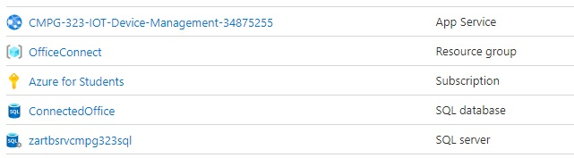
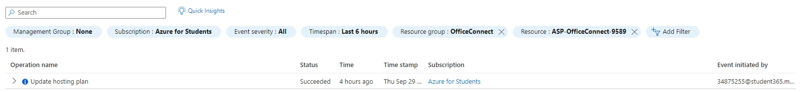
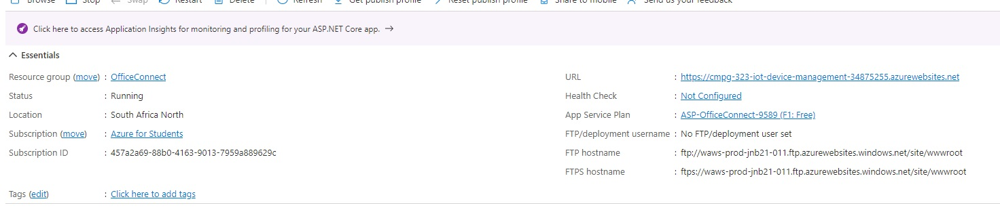
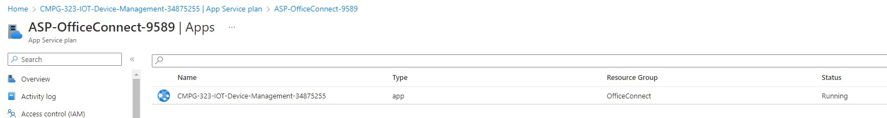

# CMPG-323-Project-3-34875255
Project is to build an interface to connect to the database, that implements RESTful services with the MVC Pattern design.
The project is intended for users to be able to register and manage IoT Device.
# Content of this project
Tier 2 Architecture design pattern
Project implements 4 Views, 4 Controllers and Repositories.
All code concerning the database are moved into the respected repositories.
A Generic repository is implemented to contain all the basic methods for RESTfull service
each controller implements its own repository with its own unique code to that controller.

## Controllers
* CategoriesController
* DevicesController
* HomeController
* ZonesController
## Basic Views for each controller 
* Create
* Delete
* Edit
* Details
* Index
## Modules
* Category
* Zone
* Device

# App Published to azure

# References
* https://youtu.be/A7qwuFnyIpM
* https://learn.microsoft.com/en-us/dotnet/api/microsoft.extensions.dependencyinjection.iservicecollection?view=dotnet-plat-ext-7.0
* https://www.tutorialsteacher.com/core/dependency-injection-in-aspnet-core
* https://learn.microsoft.com/en-us/dotnet/api/system.linq.queryable.where?view=net-6.0
* https://youtu.be/1ck9LIBxO14
* https://learn.microsoft.com/en-us/aspnet/core/fundamentals/dependency-injection?view=aspnetcore-6.0
* https://learn.microsoft.com/en-us/aspnet/mvc/overview/older-versions-1/overview/understanding-models-views-and-controllers-cs
* https://stackoverflow.com/questions/58548481/in-asp-net-mvc-how-does-a-controller-know-which-view-to-call
* https://asp.mvc-tutorial.com/views/view-discovery-connecting-controller-view/
* https://enlear.academy/repository-pattern-and-unit-of-work-with-asp-net-core-web-api-6802e1aa4f78
* https://www.freecodecamp.org/news/an-awesome-guide-on-how-to-build-restful-apis-with-asp-net-core-87b818123e28/
* https://youtu.be/gVXdofnkTt4
* https://youtu.be/Hhpq7oYcpGE
* https://learn.microsoft.com/en-us/aspnet/core/fundamentals/dependency-injection?view=aspnetcore-6.0
* https://stackoverflow.com/questions/71237723/why-dependency-injection-is-not-working-in-post-asp-net-core
* https://stackoverflow.com/questions/39174989/how-to-register-multiple-implementations-of-the-same-interface-in-asp-net-core
* https://stackoverflow.com/questions/62880026/dependency-injection-in-net-core-3-1-with-multiple-implementations
* https://stackoverflow.com/questions/71179112/net-core-dependency-injection-for-multilevel-multiple-implementation-dependenc
## Tier 3
* https://enlabsoftware.com/development/how-to-build-and-deploy-a-three-tier-architecture-application-with-c-sharp.html
* https://youtu.be/Hqj8Xxebf9Y
* https://youtu.be/bIiEv__QNxw
* https://www.technologycrowds.com/2013/12/3-tier-architecture-in-aspnet.html
* https://www.aspdotnet-suresh.com/2010/05/introduction-to-3-tier-architecture-in_17.html
* https://stackoverflow.com/questions/70187059/how-to-configure-n-tier-architecture-for-asp-net-core-mvc-with-ef-core-code-firs
* https://stackoverflow.com/questions/55566872/create-3-tier-architecture-in-dotnet-core-2-2-web-api-c-sharp
